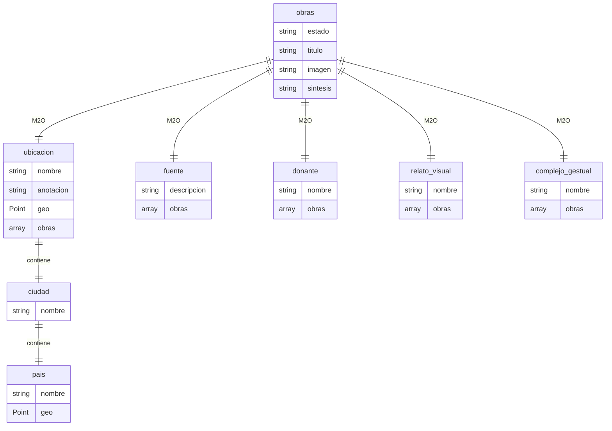
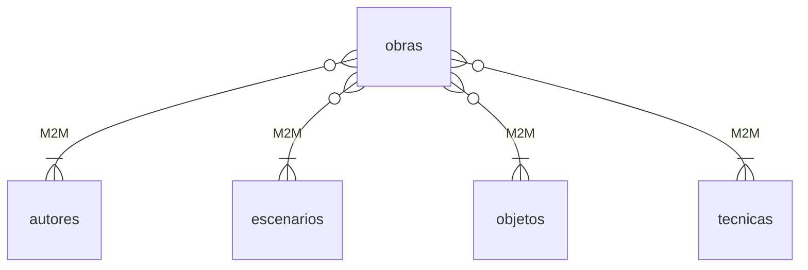

# Despliegue Arca

Conjunto de herramientas para cargar datos en la base de datos del proyecto Arca.

## Introducción

Los siguientes son los directorios del proyecto y sus funciones:

### Directorios

`cargador/`: Contiene los scripts de carga. Se pueden ejecutar individualmente o en conjunto, ejecutando el script `cargar.py`. Contiene los siguientes scripts:

- `cargar.py`: Ejecuta todos los scripts de carga en el orden correcto. Genera logs en el directorio `logs/`.

- `listas.py`: Carga las listas de control con los valores de los campos de la tabla/colección Obra en Directus.

- `obra.py`: Crea las obras y llena los campos internos de la tabla Obra y las relaciones Many To One.

- `ubicacion.py`: Midifica las ubicaciones y crea relaciones `ciudad->pais` y `ubicacion->ciudad`
- `obra_descriptores.py`: Crea las relaciones Many To Many `obra->descriptores`. Hace peticiones al recurso de la tabla intermedia de la relación.

- `obra_simbolos.py`: Crea las relaciones Many To Many `obra->simbolos`. Hace peticiones al recurso de la tabla intermedia de la relación.

- `obra_caracteristicas.py`: Crea las relaciones Many To Many `obra->caracteristicas`. Hace peticiones al recurso de la tabla intermedia de la relación.

`config/`: Archivos de configuración. Son archivos json para configurar la aplicación.

`datos/`: Tablas con los datos que se van a cargar en la aplicación. En `entrada/csv` van las tablas csv exportadas del excel de Arca. En `entrada/xslx` va el excel completo. En `salida` van las tablas exportadas del directus de arca. Estas tablas sirven para reanudar cargas parciales cuando se caen o hay que pararlas en algún momento.

`esquemas/`: Esquemas exportados de directus. Contiene la estructura de las tablas. Debe ser cargada en directus antes de ejecutar los scripts de carga.

`imgs/`: Directorio para las imágenes de arca que se deben cargar en el cms. Se debe configurar en `config.files_dir` si se quieren cargar imágenes.

`logs/`: El directorio y su contenido es ignorado por git, por lo que hay que crearlo antes de ejecutar el script. Aquí se guardan los logs generados por los scripts de carga. Cada ejecución genera su log.

`notebooks/`:Versión de los scripts en notebooks interactivos de jupyter. Se pueden usar para realizar una carga interactiva de los datos.

### Cargador

## Configuración

En el directorio `config/` hay varios archivos de configuración

### Principal

`config.json` es el archivo de configuración principal. Las variables relevantes son:

`baseurl`: La url base del api de directus al que se van a hacer los llamados o peticiones. Debe llevar `/` al final..

`csv`: Tabla en csv con el listado de obras. En el excel de arca se llama "Registro general.csv".

`files_dir`: Directorio donde se encuentran las imágenes a subir. Si el valor está vacío, el script no va a intentar subir imágenes.

`dir_tablas`:Directorio donde se encuentran las tablas de entrada. Por omisión es `datos/entrada/csv/`.

`fields_map`: Mapa de campos de la tabla/colección Obra. Es un objeto json en donde la llave o _key_ es el nombre del campo en la tabla de entrada (Registro general.csv) y el valor o _value_ es el nombre del campo en la colección Obra en el api de directus.

`m2o_map`: Mapa de campos Many To One. Es un array de objetos json. Cada objeto tiene el nombre del campo en la colección Obra en la API de Directus (`field`), el nombre del recurso o endpoint relacionado (`resource`), el nombre de la columna con el ID del campo relacionado en la tabla de entrada (`arca_id`) y el nombre de la columna que contiene el valor del campo en la tabla de entrada (`value`).

`m2m_map`: Mapa de campos Many To Many. Array de objetos json que contiene el mapeo de campos. `field` contiene el nombre del campo Many To Many en la tabla/colección obra. `m2mresource` es el nombre del recurso que contiene la tabla/colección intermedia que guarda las relaciones m2m en directus.`objects` es un arreglo de objetos con los nombres de la columna con el ID de arca del objeto a subir `arca_id` y el nombre de la columna con el valor `value`

### Listas

`listas_config.json` contiene la configuración necesaria para subir las tablas que van a ser listas controladas. Los siguientes son los campos:

`table`: Nombre de la tabla en donde se encuentran los datos a subir. A este nombre se le agrega la extensión `csv` para obtener el archivo.

`resource`: Nombre del recurso o endpoint al que se le va a realizar la petición o llamado HTTP.

`fields`: Objeto json en donde la llave o _key_ contiene el nombre de la columna con el ID de arca `id`, y luego un listado con los nombres de las columnas con los valores, vs el nombre del campo en el API de Directus donde va ese valor.

## Uso

Clonar el repositorio y entrar en el repo y crear el directorio `logs/`/cargador.

```
git clone git@github.com:enflujo/despliegue-arca.git
cd despliegue-arca
mkdir logs
```

### Crear entorno e instalar dependencias

Se recomienda crear un entorno virtual de python 3 con `virtualenvwrapper` o `conda`. En este ejemplo usamos `conda`.

`conda create -n arca python=3.9`
y
`conda activate arca`

Instalar dependencias

`pip install -r requirements.txt`

### Crear archivo de entorno

Crear un archivo `.env` con la llave del API (si aplica):

`echo "KEY=LaLlaveDelApi" > .env`

### Cargar esquema

Copiar el archivo YAML del esquema del directorio `esquema` a la carpeta compartida con la imagen de docker de directus.

Conectarse a la imagen de directus: `docker exec -it <containerID> /bin/sh`.

Aplicar el esquema o snapshot: `npx directus schema apply ./path/to/snapshot.yaml`

### Ejecutar

Entrar en el directorio de scripts y ejecutar

```
cd cargador
python cargar.py
```

### Ejecución individual

El script `cargarpy` ejecuta todos los procesos de carga mediante la importación de módulos y ejecución de la función `cargar()` en cada módulo.

Es posible ejecutar cada módulo como un script independiente, pero para que funcione se deben ejecutar en el siguiente orden:

```
python listas.py
python obra.py
python ubicacion.py
python obra_descriptores.py
python obra_simbolos.py
python obra_caracteristicas.py
```

## Notas

- Durante la configuración, desactivar cache (Redis) en docker-compose para que las respuestas del API estén inmediatamente actualizadas durante despliegue.
- Definir "Transformation Presets" en "Project Settings" para limitar las posibles transformaciones de las imágenes (asumo que si se deja libre puede saturar de copias en el servidor).

- Fechas actividad se refiere a la fecha de la obra?

### Relaciones M2O (muchos a uno)



### Relaciones M2M (muchos a muchos)


