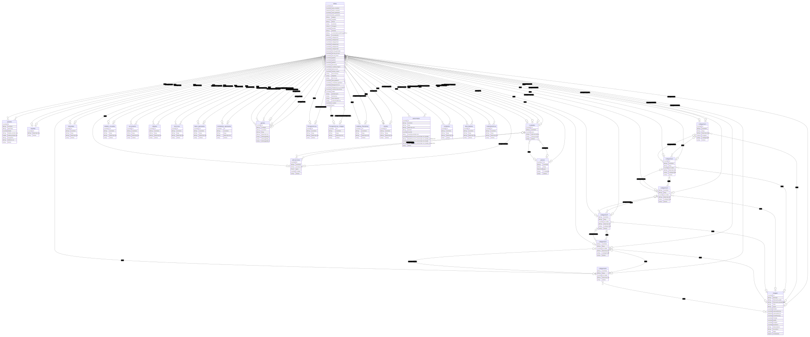

# Despliegue Arca

Conjunto de herramientas para cargar datos en la base de datos del proyecto Arca.

## Crear archivo de entorno

Crear un archivo `.env` con la llave del API (si aplica):

`echo "KEY=LaLlaveDelApi" > .env`

### Cargar esquema

Copiar el archivo YAML del esquema del directorio `esquema` a la carpeta compartida con la imagen de docker de directus.

Conectarse a la imagen de directus: `docker exec -it <containerID> /bin/sh`.

Aplicar el esquema o snapshot: `npx directus schema apply ./path/to/snapshot.yaml`

## Notas

- Durante la configuración, desactivar cache (Redis) en docker-compose para que las respuestas del API estén inmediatamente actualizadas durante despliegue.
- Definir "Transformation Presets" en "Project Settings" para limitar las posibles transformaciones de las imágenes (asumo que si se deja libre puede saturar de copias en el servidor).

### Relaciones



#### Exportar imagen de modelado en SVG

```bash
yarn diagrama
```
